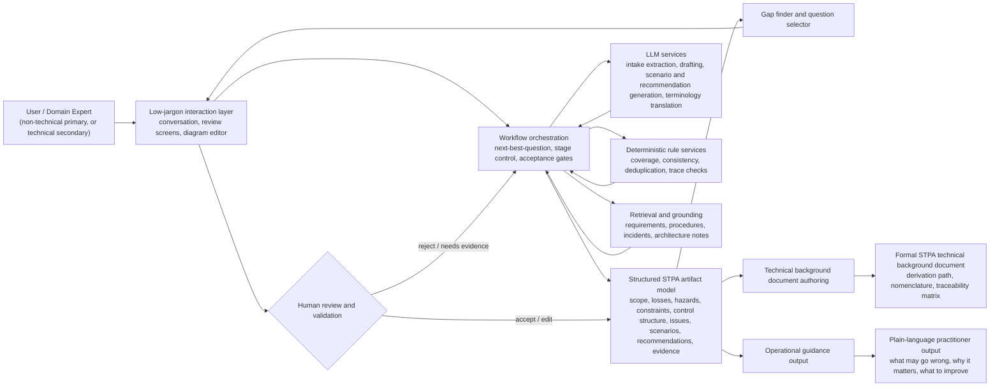

# Planning Document
# AI-Assisted STPA Copilot

*Comprehensive product intent, workflow, architecture, roadmap, and governance plan*

> **Intent statement**
>
> Build a human-in-the-loop STPA copilot that turns a rough natural-language system description into a structured, defensible hazard analysis. The primary interaction should stay in domain language rather than STPA jargon, while the platform performs the systematic STPA heavy lifting in the background and can generate a formal technical background document that records the derivation using explicit STPA nomenclature.

Document purpose. This planning document translates the product intent into a concrete build approach. It defines the target user experience, system boundaries, capabilities, data model, orchestration, document outputs, implementation phases, evaluation criteria, and delivery risks.

Prepared for concept planning and execution alignment | Date: 18 April 2026

Figure 1. Target product architecture showing the low-jargon user experience, workflow orchestration, structured STPA core, AI and rule services, human acceptance gate, and dual output model.

Static image version of the same diagram: 

## 1. Executive summary

Recommended product. A human-in-the-loop STPA copilot, not an autonomous hazard-analysis engine. The product should help analysts and domain engineers move from an incomplete system description to a structured hazard analysis, but it should require explicit user validation before findings become accepted artifacts.

- The frontstage experience should avoid unnecessary STPA terminology. The user should mainly see domain-oriented prompts such as objectives, operating modes, control decisions, feedback, overrides, degraded modes, and evidence requests.

- The backstage engine should still maintain full STPA structure: losses, hazards, constraints, controllers, control actions, unsafe or inadequate control actions, causal scenarios, assumptions, and recommended improvements.

- The product should generate two complementary outputs: a practitioner-facing summary in plain language and a technical background document that explicitly records the STPA derivation path and preserves traceability.

- The best architecture is hybrid: LLMs for elicitation and drafting, deterministic rules for coverage and consistency checks, retrieval for grounding, and a graph-backed artifact model for traceability and change impact.

## 2. Product intent and problem framing

Problem. STPA is valuable because it reveals hazards that arise from inadequate control, flawed feedback, unsafe interactions, and socio-technical coordination failures. In practice, however, the method is demanding: it requires disciplined modeling, repeated decomposition, and strong facilitation. Many teams know only fragments of the system at the outset, and many potential users are put off by the method vocabulary before they experience the benefit.

Intent. The product should make STPA operationally accessible without diluting its rigor. It should absorb the systematic work of decomposition, coverage checking, and traceability, while asking the user only for information that is domain-specific, missing, uncertain, or in need of validation.

Primary value proposition. Describe a system in your own words, answer a focused set of factual questions, review proposed issues and improvements, and receive both actionable guidance and a formal STPA record that explains how the conclusions were derived.

## 3. Product objectives and non-goals

| Area | What the product should do | What it should not do |
| --- | --- | --- |
| Analysis support | Accelerate STPA artifact creation, improve completeness, and maintain traceability. | Pretend to replace the accountable analyst or assert unsupported findings as final. |
| User experience | Stay focused on system behavior, operations, controls, feedback, and evidence. | Force users to navigate STPA jargon during normal interaction. |
| Question strategy | Ask only the highest-value missing questions and validation questions. | Run a long generic questionnaire regardless of context. |
| Output quality | Produce clear hazards, scenarios, and design improvements linked to source assumptions. | Emit generic advice disconnected from the analysis chain. |
| Documentation | Generate a formal technical background document using explicit STPA nomenclature. | Hide the derivation path once results are produced. |

## 4. Experience principles

1. Domain language first. The default interaction should use the vocabulary of the user’s system and industry. Terms such as controller, hazard, and unsafe control action can remain backstage unless the user explicitly asks for expert view.

2. Systematic work backstage. The engine should still perform full STPA structure management in the background, including decomposition by controller, control action, operating mode, and context.

3. Focused questioning. The assistant should ask for facts and validations, not for STPA mechanics. Good examples are mission objectives, operating boundaries, timing constraints, overrides, alarms, control authority, and what tells an operator that an action succeeded.

4. Human acceptance gates. Every generated artifact should have a status such as proposed, accepted, edited, rejected, or needs evidence. Accepted artifacts become the baseline model.

5. Dual-output design. The product should create both a plain-language operational output and a rigorous technical background document that can be archived, reviewed, or audited.

6. Traceability by default. Every important conclusion should be linked to upstream assumptions, accepted artifacts, and evidence sources.

## 5. Target users and usage modes

Primary users. Ordinary, reasonably educated people with no background in systems engineering, safety analysis, or STPA. They have a vague or intuitive sense that an institution, organisation, or system is not working as it should, but they do not know what a UCA, a control action, or a traceability link is. Examples include a civil servant who suspects a ministry is structurally unable to implement its own policy, a journalist investigating why a regulator consistently fails to act, a board member who cannot articulate why their organisation keeps producing outcomes nobody wants, and a community organiser trying to understand why a public institution systematically harms the people it serves. The product must work for these users without any prior study. It must never assume they know a technical term, and it must never present STPA findings without first explaining what they mean in plain language for the specific system under discussion.

Secondary users. Safety engineers, systems engineers, architects, domain experts, operators, and product teams applying these methods to non-technical or social domains rather than engineered artefacts. For these users the tool provides structured procedure and catalogue access. Technique education can be abbreviated but must not be skipped entirely, because even technical users need to understand how the methods transfer from engineering to social and institutional contexts.

Usage modes. The same platform should support three practical modes:

- Early concept exploration when the architecture is still fluid and the team has only partial information.

- Structured workshop support where multiple contributors refine hazards, scenarios, and controls together.

- Post-session consolidation in which the system turns accepted findings into recommendations, requirements candidates, and a formal technical record.

## 6. Interaction model: what the user sees versus what the system does

| User-facing interaction | Backstage system work |
| --- | --- |
| “What is this system trying to achieve, and what would count as an unacceptable outcome?” | Create draft losses, hazards, and initial safety constraints. |
| “Who decides, commands, approves, or overrides what?” | Draft controllers, control actions, authority relationships, and control structure edges. |
| “What tells each actor that the action worked or failed?” | Model sensors, feedback channels, delays, blind spots, and process-model gaps. |
| “In which situations does the system behave differently?” | Create operating modes and contextual partitions for later candidate issue generation. |
| “Please confirm or edit these proposed issues and recommendations.” | Run candidate issue generation, scenario synthesis, deduplication, and ranking. |
| “Create a technical rationale document for this analysis.” | Render the accepted analysis into a formal STPA background document with derivation trace and nomenclature. |

## 7. Functional capability set

### 7.1 Intake and scoping

- Parse a free-text system description and identify purpose, stakeholders, environment, operational context, and potential boundary elements.

- Extract candidate control entities, decisions, commands, and feedback relationships.

- Detect missing information and rank the next best questions.

### 7.2 Control-structure builder

- Maintain a graph of controllers, controlled processes, actuators, sensors, coordination links, and feedback channels.

- Support multiple operating modes, degraded modes, manual fallback, and override paths.

- Expose a clean visual draft for review.

### 7.3 Gap finder and question selector

- Prioritize questions that unlock multiple downstream analysis steps.

- Distinguish between missing facts, missing evidence, ambiguity, and contradiction.

- Avoid restating information already accepted.

### 7.4 Candidate issue generation

- Generate candidate inadequate control situations by decomposing the problem by controller, action, operating mode, and context rather than using one-shot free generation.

- Require each candidate to include why it matters, linked upstream hazards, and the assumption that makes it plausible.

- Run critic passes for duplication, vagueness, scope errors, and unsupported claims.

### 7.5 Causal-scenario generation

- Generate plausible pathways by which accepted issues could arise, including process-model errors, feedback problems, timing problems, coordination breakdowns, mode confusion, and environmental disturbances.

- Group scenarios by mechanism so that recommendations can target systemic patterns rather than isolated symptoms.

### 7.6 Recommendation and improvement authoring

- Propose design, procedural, organizational, monitoring, and requirement-level improvements.

- Classify each recommendation by prevention, detection, resilience, or recovery function.

- Link every recommendation back to scenario, issue, hazard, and loss.

### 7.7 Document and export generation

- Produce a plain-language summary, a technical background document, a traceability matrix, requirement candidates, and an implementation backlog.

- Support DOCX and PDF export with version history.

## 8. Recommended end-to-end workflow

| Workflow stage | Purpose and output |
| --- | --- |
| Stage 1 - Intake | User describes the system in domain language. The system drafts the boundary, objectives, actors, and likely control relationships. |
| Stage 2 - Focused questioning | The assistant asks only the highest-value domain questions needed to reduce ambiguity and increase downstream coverage. |
| Stage 3 - Draft control structure | The tool proposes the operational control picture and asks the user to correct authority, commands, feedback, interfaces, and modes. |
| Stage 4 - Candidate issue generation | The engine systematically generates and ranks candidate inadequate control situations for review. |
| Stage 5 - Causal-scenario synthesis | For accepted issues, the system proposes the most plausible causal scenarios and flags unsupported branches. |
| Stage 6 - Improvement generation | The system generates linked recommendations and requirement candidates, then asks the user to accept, edit, or defer them. |
| Stage 7 - Documentation | The product generates a practitioner summary and the formal STPA technical background document, preserving traceability and open issues. |

## 9. System architecture

### 9.1 Experience layer

The experience layer should mediate between user language and the structured model. It should manage conversation, review screens, visual diagrams, evidence requests, and expert-mode toggles. The central design rule is that STPA vocabulary is optional in the frontstage experience, not mandatory.

### 9.2 Orchestration layer

A workflow orchestrator should manage the current analysis stage, route generation tasks to specialized prompts, request evidence from retrieval, and enforce human acceptance gates. This layer decides whether the next best action is to ask a question, propose a control-structure change, generate candidates, or request validation.

### 9.3 Structured artifact layer

A typed artifact model should store system boundary, losses, hazards, constraints, controllers, control actions, modes, candidate issues, scenarios, recommendations, assumptions, evidence references, and statuses. This layer is the source of truth for traceability and document generation.

### 9.4 LLM services

LLMs should be used for extracting candidate structure from free text, drafting questions, translating between user language and formal artifact language, generating candidate scenarios, and authoring readable summaries. They should not be the sole arbiters of completeness or correctness.

### 9.5 Deterministic rule services

A rule layer should handle decomposition matrices, coverage checks, duplication checks, naming validation, status constraints, consistency checks, and trace integrity. Deterministic services are especially important when the system evaluates whether each controller-action-mode slice has been considered.

### 9.6 Retrieval and grounding

A retrieval layer should incorporate requirements, procedures, architecture notes, incident reports, interface descriptions, and prior analyses. Grounding reduces hallucinated scenarios and improves domain relevance.

### 9.7 Reporting layer

A reporting service should compile accepted artifacts into the user-facing outputs, including the formal STPA technical background document, without forcing the user to manually assemble the derivation history.

## 10. Data model and traceability model

| Artifact type | Core fields | Key links | Lifecycle status |
| --- | --- | --- | --- |
| System scope | Purpose, boundary, assumptions, environment, stakeholders, modes | Links to losses and control entities | Accepted baseline |
| Loss / hazard / constraint | Description, rationale, severity, owner | Loss -> hazard -> constraint | Proposed / accepted |
| Control entity | Type, role, authority, mode applicability | Control actions and feedback | Proposed / accepted |
| Control action | Issuer, recipient, preconditions, timing | Linked to controller and hazards | Proposed / accepted |
| Candidate issue | Statement, context, why problematic, confidence | Linked to action, hazard, and mode | Proposed / accepted / rejected |
| Causal scenario | Mechanism, path, assumptions, evidence | Linked to candidate issue | Proposed / accepted / needs evidence |
| Recommendation | Action, rationale, owner, difficulty, leverage | Linked back to scenario chain | Proposed / accepted / backlog |
| Evidence item | Source, excerpt, confidence, date | Supports artifacts | Referenced |

Traceability rule. The system should be able to answer, for any accepted recommendation, which scenario it addresses, which inadequate control situation it mitigates, which hazard it reduces, which loss it protects against, what evidence or assumption supports it, and who accepted it.

## 11. Reasoning and prompting strategy

### 11.1 Stage-specific prompting

- Use specialized prompts for intake, question selection, control-structure drafting, candidate issue generation, scenario generation, recommendation generation, and document authoring.

- Each prompt should be constrained by the current artifact state rather than only by raw conversation history.

### 11.2 Decomposition-driven generation

- Generate candidate issues by enumerating controller x control action x operating mode x context slices.

- This avoids one-shot brainstorming and creates an auditable completeness surface.

### 11.3 Critic and repair passes

- After each generation step, run a critic pass that checks ambiguity, duplication, unsupported claims, missing trace links, and off-scope statements.

- Where possible, repair weak artifacts automatically before presenting them to the user.

### 11.4 Confidence and evidence handling

- Separate model confidence from evidence strength. A well-phrased hypothesis without evidence should be marked as such.

- Prompt the user for confirmation when uncertainty is domain-specific and material to the conclusion.

### 11.5 Terminology translation layer

- Maintain two renderings of the same artifact set: a domain-language rendering for normal interaction and an expert-language rendering for technical reporting.

- This translation layer is essential to meeting the requirement that the user not be distracted by nomenclature during active work.

## 12. Technical background document generation

Purpose. When the analysis has produced results, especially hazards and recommended improvements, the platform should be able to author a technical background document that records the systematic derivation using explicit STPA nomenclature. This document is not merely a summary; it is the formal rationale pack.

### 12.1 Required sections in the technical background document

- Analysis scope, system purpose, system boundary, and assumptions.

- Unacceptable losses, system hazards, and resulting safety constraints.

- Control structure description including controllers, controlled processes, actuators, sensors, feedback, and operating modes.

- Enumerated control actions and the derivation of candidate and accepted inadequate or unsafe control situations.

- Accepted causal scenarios grouped by mechanism and linked to assumptions and evidence.

- Recommended improvements and requirement candidates linked back through the trace chain.

- Unresolved issues, missing evidence, and analyst decisions.

- Appendices with artifact tables, change log, and traceability matrix.

### 12.2 Authoring rules

- Use formal STPA terminology freely in this document even if the main interaction avoided it.

- Differentiate clearly between accepted findings, hypotheses needing evidence, and rejected alternatives.

- Include derivation logic in a readable order rather than dumping database tables.

- Preserve stable identifiers so that later revisions can be compared cleanly.

### 12.3 Dual-output model

| Output | Audience and tone | Typical contents |
| --- | --- | --- |
| Operational guidance | Primary users (non-specialists) and domain experts; plain language throughout, no unexplained notation | What might go wrong, why it matters, what to improve, what to validate next |
| Technical background document | Secondary users (safety engineers, auditors, program leads) and archival purposes; formal STPA language allowed | Losses, hazards, constraints, control structure, UCAs or inadequate control situations, scenarios, traceability |

## 13. Delivery roadmap

| Phase | Outcome | Scope | Exit criteria |
| --- | --- | --- | --- |
| 1 | Guided workspace | Artifact schema, acceptance workflow, plain-language intake, manual report export. | Usable structured baseline |
| 2 | AI-assisted elicitation | Gap-finding interviewer, draft control structure, targeted question selector. | Analysts reach useful model faster |
| 3 | Systematic generation | Candidate issue generation, scenario synthesis, recommendation engine, critic passes. | Quality beats naive brainstorming |
| 4 | Technical document authoring | Formal STPA background document generator with traceability matrix and revision control. | Audit-grade rationale pack |
| 5 | Domain packs | Reusable vocabularies, scenario patterns, and evidence templates by industry domain. | Better relevance and lower setup cost |

Recommended first milestone. Build the structured workspace and the terminology-translation layer first. Without these, later AI capabilities will generate text but not a controllable product.

## 14. Evaluation framework

### Analytical quality

- Accepted new findings compared with expert baseline analyses.

- False-positive rate and rejection rate of generated candidate issues.

- Trace completeness from recommendation back to losses and assumptions.

### Workflow performance

- Time to first usable control structure.

- Number of questions asked per accepted artifact.

- User edit burden and review cycle count.

### Business value

- Number of recommendations adopted into requirements or design backlog.

- Usefulness in early architecture decisions and tradeoff discussions.

- Quality of exported technical rationale documents in peer review.

### Trust and governance

- Percentage of accepted artifacts backed by explicit evidence or acknowledged assumptions.

- Rate of unsupported assertions caught by critic and review gates.

## 15. Key risks and mitigations

| Risk | Why it matters | Mitigation |
| --- | --- | --- |
| LLM overconfidence | Plausible but unsupported hazards can erode trust. | Use evidence labels, critic passes, and mandatory user acceptance states. |
| Jargon overload | Users may disengage before analysis value becomes visible. | Keep the primary UX in domain language and expose expert terminology only on demand or in formal reports. |
| Generic recommendations | Advice loses value if not tightly linked to the analysis chain. | Require every recommendation to reference scenario, issue, hazard, and loss. |
| Traceability drift | Artifacts become inconsistent after edits and iterations. | Use stable IDs, graph-backed links, and consistency checks on every revision. |
| Weak grounding | The system may miss domain-specific hazards or invent details. | Use retrieval over project materials and ask targeted domain verification questions. |

## 16. Recommended delivery model

Core team. Product lead, safety or systems-engineering lead with STPA experience, ML engineer, backend engineer, frontend engineer, and technical writer or reporting specialist.

Suggested platform components. Conversation service, orchestration engine, artifact graph store or relational model with explicit links, retrieval service, reporting service, and document renderer.

- Store accepted artifacts in a structured repository rather than only in conversation logs.

- Treat versioning and export as first-class platform capabilities.

- Design APIs so that later integrations with requirements tools or MBSE environments remain possible.

## 17. Immediate next steps

1. Define the artifact schema and lifecycle states in detail, including dual renderings for plain-language and expert-language views.

2. Prototype the frontstage conversation flow for one representative system and measure how many questions are needed to reach a usable control structure.

3. Implement a minimal control-structure editor and acceptance workflow before adding advanced generation.

4. Design the technical background document template and generate it from structured artifacts rather than from free-form summaries.

5. Run an evaluation against at least one existing human-produced STPA analysis to calibrate acceptance rate, quality gaps, and review burden.

## References

[1] FAA, Software Assurance Approaches, Considerations, and Limitations, report TC-15-57. Relevant discussion of STPA as a hazard-analysis technique for complex software-intensive systems and the standard inadequate-control-action framing. https://www.faa.gov/sites/faa.gov/files/aircraft/air_cert/design_approvals/air_software/TC-15-57.pdf

[2] Charalampidou et al., Hazard analysis in the era of AI: Assessing the usefulness of ChatGPT4 in STPA hazard analysis, Safety Science, 2024. Highlights benefits in system understanding, loss-scenario generation, and safety specifications, with weaker performance on UCA generation and verification. https://www.sciencedirect.com/science/article/abs/pii/S092575352400198X

[3] Qi et al., Safety analysis in the era of large language models: A case study of STPA using ChatGPT, Machine Learning with Applications, 2025. Reports that STPA-specific prompt engineering improved relevance and that stand-alone use without human intervention is inadequate because of reliability concerns. https://www.sciencedirect.com/science/article/pii/S2666827025000052

[4] Bober et al., An LLM-Integrated Framework for Completion, Management, and Tracing of STPA, arXiv, 2025. Describes an open-source framework focused on STPA artifact completion and traceability. https://arxiv.org/html/2503.12043v1

[5] Poh et al., A Safety-Driven Approach to Exploring and Comparing Air Traffic Management Concepts for Enabling Urban Air Mobility, NASA / ICRAT, 2024. Demonstrates STPA-based early design exploration and tradeoff analysis before simulation exists. https://ntrs.nasa.gov/api/citations/20240007652/downloads/Poh_ICRAT2024_MIT_Submission_Final.pdf

[6] STAMP Workbench 2.0 documentation, Information-technology Promotion Agency, Japan. Indicates the continued value of structured STAMP/STPA modeling tools and tutorialized workflows. https://www.ipa.go.jp/en/digital/complex_systems/stamp_wb/manual_en/index.html
